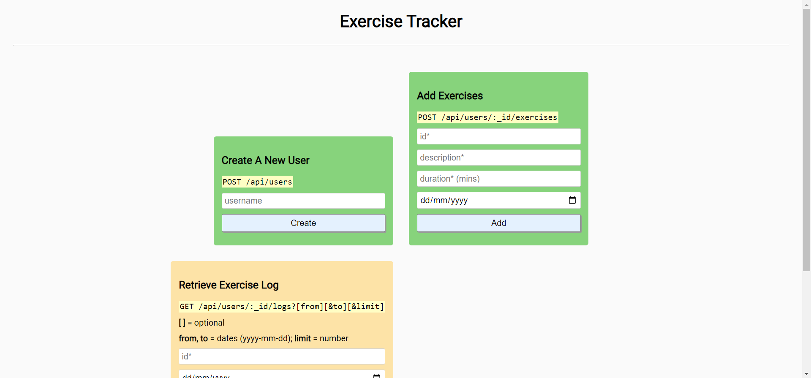

# Exercise Tracker



Exercise tracker for Back End Development and APIs in [freeCodeCamp](https://www.freecodecamp.org/learn/).

[Live Website](https://exercise-tracker-chiefwoods.replit.app/)

[Source Repository](https://github.com/ChiefWoods/exercise-tracker)

## Built With

### Languages

- [](https://html5.org/)
- [](https://www.w3.org/Style/CSS/Overview.en.html)
- [](https://js.org/index.html)

### Frameworks, Packages and Runtime

- [](https://expressjs.com/)
- [](https://www.dotenv.org/)
- [](https://mongoosejs.com/)
- [](https://nodejs.org/en)

### Database

- [](https://www.mongodb.com/)

### Tools

- [](https://code.visualstudio.com/)
- [](https://replit.com/)

## Getting Started

### Prerequisites

Update your npm package to the latest version.

```
npm install npm@latest -g
```

### Setup

1. Clone the repository

```
git clone https://github.com/ChiefWoods/exercise-tracker.git
```

2. Install all dependencies

```
npm install
```

3. Start development server

```
npm run start
```

## Issues

View the [open issues](https://github.com/ChiefWoods/exercise-tracker/issues) for a full list of proposed features and known bugs.

## Acknowledgements

### Resources

- [Shields.io](https://shields.io/)
- [Google Fonts](https://fonts.google.com/)
- [Pictogrammers](https://pictogrammers.com/)

### Hosting

- [Replit](https://replit.com/)

## Contact

[chii.yuen@hotmail.com](mailto:chii.yuen@hotmail.com)